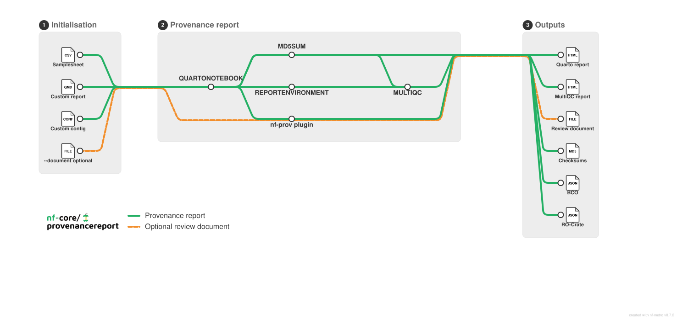

<h1>
  <picture>
    <source media="(prefers-color-scheme: dark)" srcset="docs/images/nf-core-provenancereport_logo_dark.png">
    
  </picture>
</h1>

[](https://github.com/codespaces/new/nf-core/provenancereport)
[](https://github.com/nf-core/provenancereport/actions/workflows/nf-test.yml)
[](https://github.com/nf-core/provenancereport/actions/workflows/linting.yml)[](https://nf-co.re/provenancereport/results)[](https://doi.org/10.5281/zenodo.XXXXXXX)
[](https://www.nf-test.com)

[](https://www.nextflow.io/)
[](https://github.com/nf-core/tools/releases/tag/4.0.2)
[](https://docs.conda.io/en/latest/)
[](https://www.docker.com/)
[](https://sylabs.io/docs/)
[](https://cloud.seqera.io/launch?pipeline=https://github.com/nf-core/provenancereport)

[](https://nfcore.slack.com/channels/provenancereport)[](https://bsky.app/profile/nf-co.re)[](https://mstdn.science/@nf_core)[](https://www.youtube.com/c/nf-core)

## Introduction

**nf-core/provenancereport** is a reporting pipeline that validates a samplesheet and renders reproducible Quarto reports. The samplesheet has two columns, `id` and `path`, where each row points to one input file. The pipeline stages all listed files into a single Quarto render and publishes the rendered report plus any generated artifacts.

### Requirements

- Nextflow `25.10.4` or later.
- A supported execution environment such as Docker, Singularity, Apptainer, or Conda. Docker or Singularity is recommended for reproducibility.
- Read access to the samplesheet and every file it references, plus write access to `--outdir`.
- For a custom `--notebook`, a configured report runtime containing Quarto and every language, package, and system dependency used by that notebook.

See the [usage requirements](docs/usage.md#requirements) for details.

The default workflow performs the following steps:

1. Validate and normalise the input samplesheet with `nf-schema`.
2. Resolve each `path` entry from the samplesheet as one input file.
3. Render one Quarto notebook with all listed files using the nf-core `quarto_notebook` module.
4. Calculate MD5 checksums for every samplesheet input and the rendered Quarto HTML using the nf-core `md5sum` module.
5. Run `REPORTENVIRONMENT` in the resolved Quarto runtime to collect the R session, Python version, and container or Conda environment details.
6. If `--document` is provided, publish the review or sign-off document with the pipeline results.
7. Generate a MultiQC audit report containing the input samplesheet, file checksums, published outputs, run configuration, software versions, and runtime information.
8. Generate BCO and Workflow Run RO-Crate provenance with the `nf-prov` plugin.
9. Publish the reports, artifacts, checksums, and standard Nextflow execution metadata.



## Usage

> [!NOTE]
> If you are new to Nextflow and nf-core, please refer to [this page](https://nf-co.re/docs/get_started/environment_setup/overview) on how to set-up Nextflow. Make sure to [test your setup](https://nf-co.re/docs/get_started/run-your-first-pipeline) with `-profile test` before running the workflow on actual data.

First, prepare a samplesheet with your input data that looks as follows:

`samplesheet.csv`:

```csv
id,path
counts,counts.tsv
metadata,metadata.tsv
```

Each row represents exactly one input file. The `id` value is included in `params$input_ids`, and `path` must point to a single file.

Now, you can run the pipeline using:

```bash
nextflow run nf-core/provenancereport \
   -profile <docker/singularity/.../institute> \
   --input samplesheet.csv \
   --outdir <OUTDIR>
```

By default, the pipeline renders the bundled notebook in `assets/provenance_report.qmd`. To render your own custom Quarto notebook, provide `--notebook custom_report.qmd`.

Report inputs are staged into the Quarto render working directory by basename. Custom notebooks should read those staged filenames directly, for example `readxl::read_xlsx("counts.xlsx")`, and every file listed in the samplesheet must have a unique basename. See the usage documentation for details on designing custom reports.

> [!WARNING]
> Please provide pipeline parameters via the CLI or Nextflow `-params-file` option. Custom config files including those provided by the `-c` Nextflow option can be used to provide any configuration _**except for parameters**_; see [docs](https://nf-co.re/docs/running/run-pipelines#using-parameter-files).

For more details and further functionality, please refer to the [usage documentation](https://nf-co.re/provenancereport/usage) and the [parameter documentation](https://nf-co.re/provenancereport/parameters).

## Pipeline output

A successful run produces:

- `quartonotebook/*.html`: the rendered Quarto report, plus the source notebook and any report artifacts.
- `md5sum/provenancereport.md5`: checksums for every samplesheet input and the rendered report.
- `multiqc/multiqc_report.html`: an audit report covering inputs, checksums, outputs, parameters, software versions, and the report runtime.
- `pipeline_info/manifest_<timestamp>.bco.json` and `ro-crate-metadata_<timestamp>.json`: BCO and Workflow Run RO-Crate provenance.
- `pipeline_info/`: Nextflow execution reports, trace, DAG, parameters, and collected software versions.
- The original review or sign-off file at the results root when `--document` is provided.

For the complete directory layout and guidance on interpreting each file, see the [output documentation](https://nf-co.re/provenancereport/output).

## Credits

nf-core/provenancereport was originally written by Alexander Peltzer, Gregor Sturm, Julian Schwab.

We thank the following people for their extensive assistance in the development of this pipeline:

Antonia Saracco, Delfina Terradas, Anabella Trigila.

## Contributions and Support

If you would like to contribute to this pipeline, please see the [contributing guidelines](docs/CONTRIBUTING.md).

For further information or help, don't hesitate to get in touch on the [Slack `#provenancereport` channel](https://nfcore.slack.com/channels/provenancereport) (you can join with [this invite](https://nf-co.re/join/slack)).

## Citations

<!-- TODO nf-core: Add citation for pipeline after first release. Uncomment lines below and update Zenodo doi and badge at the top of this file. -->
<!-- If you use nf-core/provenancereport for your analysis, please cite it using the following doi: [10.5281/zenodo.XXXXXX](https://doi.org/10.5281/zenodo.XXXXXX) -->

Please cite the core reporting and provenance software used by the pipeline:

> **Quarto.**
>
> J.J. Allaire, Charles Teague, Carlos Scheidegger, Yihui Xie, Christophe Dervieux & Gordon Woodhull.
>
> _Computer software._ [https://quarto.org/](https://quarto.org/).

> **nf-prov: Nextflow plugin to render provenance reports for pipeline runs.**
>
> Nextflow.
>
> _Computer software_, version 1.7.0. [nextflow-io/nf-prov](https://github.com/nextflow-io/nf-prov/releases/tag/1.7.0).

An extensive list of references for the tools used by the pipeline can be found in the [`CITATIONS.md`](CITATIONS.md) file.

You can cite the `nf-core` publication as follows:

> **The nf-core framework for community-curated bioinformatics pipelines.**
>
> Philip Ewels, Alexander Peltzer, Sven Fillinger, Harshil Patel, Johannes Alneberg, Andreas Wilm, Maxime Ulysse Garcia, Paolo Di Tommaso & Sven Nahnsen.
>
> _Nat Biotechnol._ 2020 Feb 13. doi: [10.1038/s41587-020-0439-x](https://dx.doi.org/10.1038/s41587-020-0439-x).
