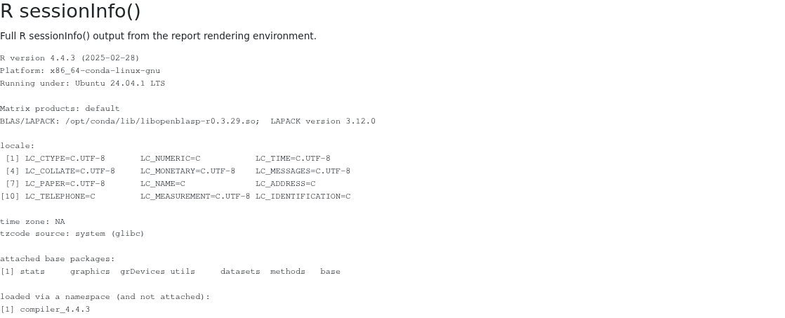

# nf-core/provenancereport: Output

## Introduction

This document describes the output produced by the pipeline.

The directories listed below will be created in the results directory after the pipeline has finished. All paths are relative to the top-level results directory.

## Output summary

| Output                    | Path                                          | Purpose                                                                                           |
| ------------------------- | --------------------------------------------- | ------------------------------------------------------------------------------------------------- |
| Rendered report           | `quartonotebook/*.html`                       | Final Quarto HTML report generated from all samplesheet inputs.                                   |
| Report source             | `quartonotebook/*.qmd`                        | Prepared notebook copy used to render the report, including the guarded package-version fallback. |
| Rendered report index     | `reports.csv`                                 | Nextflow-generated index of the published HTML report.                                            |
| Report source index       | `notebook.csv`                                | Nextflow-generated index of the published prepared notebook.                                      |
| Report artifacts          | `quartonotebook/artifacts/*`                  | Images, tables, summaries, or other secondary files written by the notebook.                      |
| Report artifact index     | `artifacts.csv`                               | Nextflow-generated index of the published report artifacts.                                       |
| File checksums            | `md5sum/provenancereport.md5`                 | MD5 checksums for every samplesheet input, the rendered report, and the optional review document. |
| MultiQC audit report      | `multiqc/multiqc_report.html`                 | Human-readable summary of inputs, outputs, checksums, parameters, software, and runtime details.  |
| MultiQC output index      | `multiqc_report.csv`                          | Nextflow-generated index of the published MultiQC report and data directory.                      |
| Optional review document  | `<original document filename>`                | Copy of the file supplied with `--document`, published at the results root.                       |
| Review document index     | `document.csv`                                | Nextflow-generated index, published only when `--document` is supplied.                           |
| BioCompute Object         | `pipeline_info/manifest_<timestamp>.bco.json` | Machine-readable BCO provenance record generated by `nf-prov`.                                    |
| Workflow Run RO-Crate     | `ro-crate-metadata.json`                      | Machine-readable Workflow Run RO-Crate metadata generated by `nf-prov`.                           |
| RO-Crate supporting files | Files copied to the results root              | Pipeline definition and workflow inputs recorded by `nf-prov` alongside the crate metadata.       |
| Nextflow execution record | `pipeline_info/`                              | Execution report, timeline, trace, DAG, parameters, and collected software versions.              |

## Pipeline overview

The pipeline is built using [Nextflow](https://www.nextflow.io/) and renders Quarto reports from user-provided input files. It processes data using the following steps:

- [Quarto notebook reports](#quarto-notebook-reports) - HTML reports rendered by the nf-core `quarto_notebook` module
- [File checksums](#file-checksums) - MD5 checksums for report inputs, the rendered report, and the optional review document
- [Review document](#review-document) - Optional review or sign-off file published with the run
- [MultiQC execution report](#multiqc-execution-report) - Auditable summary of the run configuration and runtime environment
- [nf-prov provenance](#nf-prov-provenance) - Provenance reports generated by the `nf-prov` plugin
- [Pipeline information](#pipeline-information) - Report metrics generated during the workflow execution

### Quarto notebook reports

Output files

- `quartonotebook/`
  - `*.html`: One rendered HTML report for the full samplesheet. The default filename is based on the notebook name, for example `provenance_report.html`.
  - `*.qmd`: The prepared Quarto notebook used to generate the report. Its name is prefixed with `prepared_` to distinguish it from the unchanged source notebook.
- `reports.csv`: Nextflow-generated index containing the published HTML report path.
- `notebook.csv`: Nextflow-generated index containing the published prepared-notebook path.

The reports are generated by the nf-core `quarto_notebook` module. The workflow passes the selected notebook, a parameter map describing all samplesheet rows, and the staged input files into the module. This allows custom notebooks to read one or more files from the task working directory and render report-specific output.

`RENDER_QUARTO_WITH_PROVENANCE` groups notebook preparation and rendering into one local subworkflow. Within it, `QUARTO_PREPARE` creates the published notebook copy and appends a guarded hidden cell for runtime package capture. `QUARTO_NOTEBOOK` reports Quarto and Papermill through its eval outputs and collects notebook package versions through `versions.csv`. A user-provided CSV takes precedence; otherwise the hidden cell records packages loaded in the R session or Python kernel. The module validates the CSV and converts it to the process-keyed YAML consumed by the Nextflow `versions` topic. Intermediate files such as `versions.csv` and per-task `params.yml` are not published.

### Report artifacts

Output files

- `quartonotebook/[artifact_dir]`
  - Files written by the notebook to `params$artifact_dir`, such as `*_input_files.tsv`, `*_summary.txt`, images, or tables.
- `artifacts.csv`: Nextflow-generated index containing the published paths of all report artifacts.

Custom notebooks should write secondary output files to `params$artifact_dir`. The `quarto_notebook` module emits files from that directory through its `artifacts` output, and the pipeline publishes them alongside the HTML reports. Use stable artifact filenames when writing custom output files.

### File checksums

Output files

- `md5sum/`
  - `provenancereport.md5`: MD5 checksums for all samplesheet inputs, the rendered Quarto HTML report, and the review document when `--document` is provided.

Checksums are calculated with the nf-core `md5sum` module. They are also collected into the **File Checksums** table in the MultiQC report, immediately below the input samplesheet.

### Review document

Output files

- `<original document filename>`: Copy of the review or sign-off file supplied with `--document`, published at the top level of the results directory.
- `document.csv`: Nextflow-generated index containing the published document path. This file is present only when `--document` is provided.

This output is present only when `--document` is provided. The file is retained as supporting evidence for the run and listed with its published path in the MultiQC **Pipeline Outputs** table; it does not affect Quarto rendering.

### MultiQC execution report

Output files

- `multiqc/`
  - `multiqc_report.html`: Standalone pipeline execution and provenance report.
  - `multiqc_data/`: Machine-readable data used to build the report.
- `multiqc_report.csv`: Nextflow-generated index containing the published paths of the MultiQC report and data directory.

The MultiQC report is generated with the nf-core `multiqc` module and is configured as a report in `tower.yml`, allowing Seqera Platform to display it in the run Reports tab. It contains:

- The validated input samplesheet and workflow parameter summary.
- A table listing every samplesheet input, the rendered Quarto report, and the optional review document with their MD5 checksums.
- A table listing the rendered Quarto HTML report and, if applicable, the supplied review document together with their published output paths.
- The exact pipeline launch command and a description of the report-generation steps.
- The resolved `QUARTO_NOTEBOOK` runtime backend and reference, container engine, active Nextflow profile, `R sessionInfo()` output, and Python version. `REPORTENVIRONMENT` inherits the resolved container or Conda runtime when possible; with no managed runtime, the runtime is reported as `Not configured`.
- Pipeline and Nextflow versions, Quarto and Papermill versions, and package versions recorded from the notebook session by `QUARTO_NOTEBOOK`.

#### Published outputs

The **Pipeline Outputs** table lists the files intended for users and their locations below the results directory. In this example, `review_signoff.md` was supplied with `--document` and is listed alongside the rendered Quarto report.

#### Report runtime environment

The **Report Runtime Environment** table identifies the runtime inherited from `QUARTO_NOTEBOOK`. The adjacent **R sessionInfo()** section records the R version, platform, locale, and packages visible to a fresh R session in that environment. Versions of packages referenced directly by the notebook are recorded separately in the MultiQC **Software Versions** section.

### nf-prov provenance

Output files

- `pipeline_info/manifest_<timestamp>.bco.json`: BioCompute Object provenance report.
- `ro-crate-metadata.json`: Workflow Run RO-Crate metadata at the results root.
- Supporting Workflow Run RO-Crate files at the results root, including the pipeline `README.md`, `main.nf`, `nextflow.config`, `nextflow_schema.json`, and copies of workflow inputs such as the samplesheet and optional review document.

The `nf-prov` plugin creates both provenance records at the end of the run. When `--document` is supplied, its top-level published copy is also recorded in the RO-Crate. The default timestamp suffix on the BCO filename can be changed with `--trace_report_suffix`.

### Pipeline information

Output files

- `pipeline_info/`
  - Reports generated by Nextflow: `execution_report_<timestamp>.html`, `execution_timeline_<timestamp>.html`, `execution_trace_<timestamp>.txt`, and `pipeline_dag_<timestamp>.html`.
  - Reports generated by the pipeline: `pipeline_report.html`, `pipeline_report.txt` and `nf_core_provenancereport_software_mqc_versions.yml`. The `pipeline_report*` files will only be present if the `--email` or `--email_on_fail` parameters are used when running the pipeline.
  - Parameters used by the pipeline run: `params_<timestamp>.json`.

[Nextflow](https://www.nextflow.io/docs/latest/tracing.html) provides excellent functionality for generating various reports relevant to the running and execution of the pipeline. This will allow you to troubleshoot errors with the running of the pipeline, and also provide you with other information such as launch commands, run times and resource usage.
